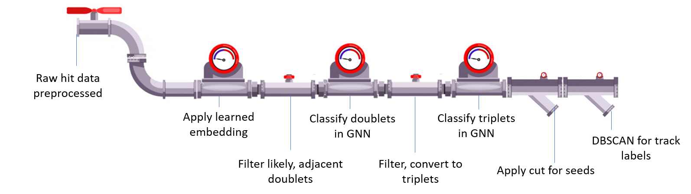

# CTD2020 ExatrkX

Each `stage` of the pipeline can be executed separately by running `python [path/to/config]` followed by one of the stages:

<pre>
      <a href="MetricLearning/src/preprocess_with_dir" title="Preprocessing function">preprocess</a>             <a href="MetricLearning/src/metric_learning_adjacent" title="Doublet building function">build_doublets</a>           <a href="GraphLearning/src/" title="Triplet building function">build_triplets</a>                 <a href="Seeding/src" title="Seeding function function">seed</a>          <a href="Labelling" title="Labelling function">label</a>
</pre>



```
            Build
     +-----------------+


   +---------------------+
   |   Metric Learning   |
   +----------+----------+
              |
              |
              |
              v

       buildDoublets.py

              +
              |
              |
              |
              v
   +----------+---------+
   |   GraphLearning    |
   +----------+---------+
              |
              |
              |
              v

        train.py doubletAGNN.yaml

              +
              |
              v


       buildTriplets.py

              +
              |
              v

        train.py tripletAGNN.yaml

                  +
                  |
         +--------+-------+
         |                |
         |                |
         |                |
         |                |
         v                v

+------------+       +-----------+
|  Seeding   |       | Labelling |
+------------+       +-----------+

      +                    +
      |                    |
      |                    |
      v                    v

   seed.py              label.py
     config.yaml           config.yaml

```
